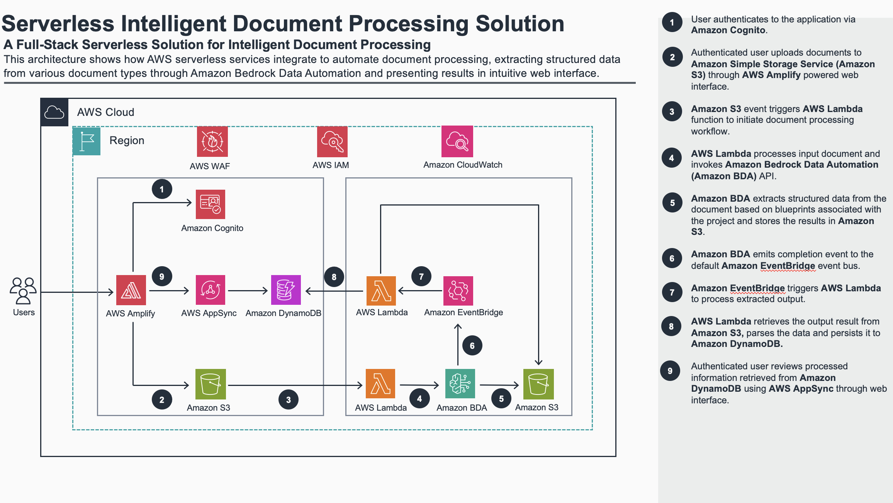

# Serverless Multi-Document Intelligent Document Processing on AWS

A full-stack serverless application that automates document processing using AWS Bedrock Data Automation (BDA). Upload documents through an Angular web interface hosted on AWS Amplify, and get structured data extraction powered by a CDK-deployed backend.

> **⚠️ Disclaimer — sample code only.** This repository is a sample intended to demonstrate a working IDP pipeline on AWS. Before deploying beyond a POC environment, follow your organization's standards and review processes for security, reliability, performance, and compliance, and customize the code and infrastructure to match those requirements.
>
> **Review your data classification before uploading.** The sample ships with synthetic documents only for demonstration. Classify documents against your organization's data classification policy and confirm the solution's controls meet the requirements for that classification before use. See [Deployment Considerations](#deployment-considerations) for details.

## Table of Contents

- [Architecture](#architecture)
- [Supported Document Types](#supported-document-types)
- [Getting Started](#getting-started)
  - [Prerequisites](#prerequisites)
  - [Supported Regions](#supported-regions)
- [Deployment](#deployment)
  - [Step 1: Install Dependencies and Run Tests](#step-1-install-dependencies-and-run-tests)
  - [Step 2: Create the Bedrock Data Automation (BDA) Project](#step-2-create-the-bedrock-data-automation-bda-project)
  - [Step 3: Deploy the Backend](#step-3-deploy-the-backend)
  - [Step 4: Deploy the Frontend to Amplify](#step-4-deploy-the-frontend-to-amplify)
  - [Step 5: Create a Cognito User](#step-5-create-a-cognito-user)
  - [Step 6: Access the Application](#step-6-access-the-application)
- [Cost Estimation](#cost-estimation)
- [Cleanup](#cleanup)
- [Next Steps](#next-steps)
- [Deployment Considerations](#deployment-considerations)
- [Security](#security)
- [Troubleshooting](#troubleshooting)
- [Contributing](#contributing)
- [License](#license)

## Architecture



## Supported Document Types

Three custom blueprints wired end-to-end, each with a BDA blueprint, a typed frontend model, and a dedicated review screen. Uploading any of these exercises the full pipeline.

| Document Type | Blueprint Name | Key Extracted Fields |
|---------------|----------------|---------------------|
| Invoice | `Invoice` | Invoice number, vendor, customer, line items, totals |
| US High School Transcript | `Transcript` | Student, school, courses, grades, credits |
| Business License | `BusinessLicense` | License number, status, business entity, NAICS, issue/expiration |

All three are custom blueprints — you can edit each blueprint's fields to match your own document shapes without touching application code.

To add new document types or enable batch processing, see [NEXT_STEPS.md](NEXT_STEPS.md).

## Getting Started

### Prerequisites

- Node.js 22.x or later
- AWS CLI configured with valid credentials
- AWS CDK CLI (`npm install -g aws-cdk`)
- Angular CLI (`npm install -g @angular/cli`)
- An AWS account with access to Amazon Bedrock Data Automation in the chosen deployment region (`us-east-1` or `us-west-2`)

### Supported Regions

Deploy the backend to either **`us-east-1`** or **`us-west-2`** via the `TARGET_REGION` env var. The CloudFront-scoped WAF for Amplify Hosting always lives in `us-east-1`, so the infrastructure is split into two CDK stacks that deploy together via `cdk deploy --all`.

```bash
export CDK_DEFAULT_ACCOUNT=$(aws sts get-caller-identity --query Account --output text)
export TARGET_REGION=us-east-1        # or us-west-2
export BACKEND_STACK_NAME=idp-workshop-backend
export BDA_PROJECT_NAME=idp-workshop-project
```

## Deployment

### Step 1: Install Dependencies and Run Tests

```bash
git clone <repository-url>
cd serverless-multi-document-idp-on-aws
npm run install:all
npm test
```

All tests should pass before proceeding with deployment.

### Step 2: Create the Bedrock Data Automation (BDA) Project

Follow [BDA_SETUP.md](BDA_SETUP.md) to create the BDA project and the three custom blueprints (`Invoice`, `Transcript`, `BusinessLicense`) in the Bedrock console.

### Step 3: Deploy the Backend

Bootstrap both regions once per account (the WAF stack always needs `us-east-1`; the backend needs your target region):

```bash
cd infra

# WAF stack always needs us-east-1
npx cdk bootstrap "aws://${CDK_DEFAULT_ACCOUNT}/us-east-1"

# Bootstrap the target region too (skipped if it's already us-east-1)
if [ "$TARGET_REGION" != "us-east-1" ]; then
  npx cdk bootstrap "aws://${CDK_DEFAULT_ACCOUNT}/${TARGET_REGION}"
fi
```

Look up the BDA Project ARN by name (uses `$BDA_PROJECT_NAME` from the [Supported Regions](#supported-regions) section). No need to copy the ARN from the console — the command below resolves it automatically. The BDA Profile ARN is derived from the Project ARN during deployment.

```bash
# Look up the BDA Project ARN by name
export BDA_PROJECT_ARN=$(aws bedrock-data-automation list-data-automation-projects \
  --region "$TARGET_REGION" \
  --query "projects[?projectName=='$BDA_PROJECT_NAME'].projectArn | [0]" \
  --output text)
```

Deploy both stacks. `cdk deploy --all` respects the dependency between the stacks, so the backend (which creates the Amplify app) deploys first, then the WAF stack associates the CLOUDFRONT-scoped WebACL:

```bash
npx cdk deploy --all
```

This creates:

- **`idp-workshop-backend`** (target region): Cognito User Pool, S3 bucket, DynamoDB tables, AppSync API (with REGIONAL WAF), Lambda functions, EventBridge rule, SQS DLQ, Amplify Hosting app
- **`idp-workshop-frontend-waf`** (us-east-1): CLOUDFRONT-scoped WAF WebACL, associated with the Amplify app from the backend stack

### Step 4: Deploy the Frontend to Amplify

```bash
cd ..
npm run deploy-frontend
```

This generates the frontend config from the backend stack outputs, builds the Angular app, and deploys to Amplify Hosting. The script outputs the app URL when it completes.

### Step 5: Create a Cognito User

Self-signup is disabled. Create users via the CLI.

Set the User Pool ID and create a user. Cognito will auto-generate a temporary password and email it to the user. On first login, the app will prompt them to set a permanent password.

```bash
# Look up the User Pool ID from the backend stack outputs
export USER_POOL_ID=$(aws cloudformation describe-stacks \
  --stack-name "$BACKEND_STACK_NAME" \
  --region "$TARGET_REGION" \
  --query "Stacks[0].Outputs[?OutputKey=='UserPoolId'].OutputValue" \
  --output text)

# Set to your email address
export USER_EMAIL=<your-email>

aws cognito-idp admin-create-user \
  --region "$TARGET_REGION" \
  --user-pool-id "$USER_POOL_ID" \
  --username "$USER_EMAIL" \
  --user-attributes "Name=email,Value=$USER_EMAIL" "Name=email_verified,Value=true"
```

The user will receive an email with their temporary password. Check spam/junk if it doesn't arrive (the default sender is `no-reply@verificationemail.com`).

Self-service password recovery is disabled. To reset a user's password, use `admin-set-user-password` via the CLI.

### Step 6: Access the Application

Open the Amplify app URL from the deploy output (e.g., `https://main.d1234abcd.amplifyapp.com`):

1. Sign in with the credentials from Step 5
2. Navigate to **Upload** and upload a supported document (PDF, PNG, JPEG, or TIFF — max 2 MB)
3. Monitor processing status in **Review**

## Cost Estimation

Approximately $55/month for 1,000 documents processed by 20 users (single-page documents with ≤30 blueprint fields).

| Service | Cost |
|---------|------|
| Amazon Bedrock Data Automation | $40.00 |
| AWS WAF (2 WebACLs) | $14.00 |
| Amazon DynamoDB | $1.00 |
| AWS AppSync | $0.12 |
| Amazon S3 | $0.05 |
| AWS Lambda | $0.00 (free tier) |
| Amazon Cognito | $0.00 (free tier) |
| AWS Amplify Hosting | $0.00 (free tier) |
| Amazon EventBridge | $0.00 (free tier) |
| **Total** | **~$55** |

> BDA pricing scales at $0.04 per page for custom output blueprints with 30 fields or fewer. Multi-page documents are charged per page (for example, a 2-page transcript costs $0.08 rather than $0.04). See [Amazon Bedrock pricing](https://aws.amazon.com/bedrock/pricing/) for details.

## Cleanup

To avoid ongoing charges, delete all resources in this order:

### 1. Delete the CDK Stacks

```bash
cd infra

# Destroy both stacks (respects dependency order)
npx cdk destroy --all --force
```

This removes all AWS resources across both stacks (CLOUDFRONT WAF in us-east-1, and everything else in the target region). CDK handles the deletion order automatically — the backend stack is destroyed first, then the frontend WAF stack.

> If stack deletion fails on the S3 bucket, empty it manually via the S3 console and retry.

### 2. Delete the BDA Project

1. Open the [Amazon Bedrock console](https://console.aws.amazon.com/bedrock/)
2. Navigate to **Data Automation** → **Projects**
3. Select the BDA project you created in Step 2 and click **Delete**

### 3. Verify Cleanup

- [CloudFormation](https://console.aws.amazon.com/cloudformation/) — No `idp-workshop-backend` or `idp-workshop-frontend-waf` stack (check both us-east-1 and your target region)
- [Amplify](https://console.aws.amazon.com/amplify/) — No `idp-workshop-frontend-*` app
- [S3](https://console.aws.amazon.com/s3/) — No `idp-workshop-storage-*` bucket
- [Cognito](https://console.aws.amazon.com/cognito/) — No `idp-workshop-*` user pool
- [WAF](https://console.aws.amazon.com/wafv2/) — No `idp-workshop-*` WebACLs (check REGIONAL scope in target region and CLOUDFRONT scope in us-east-1)

## Next Steps

See [NEXT_STEPS.md](NEXT_STEPS.md) for guidance on adding new document types, enabling bulk processing, and promoting the BDA project to CDK.

## Deployment Considerations

This repository is a sample intended to demonstrate a working IDP pipeline on AWS. Before deploying beyond a POC environment, apply your organization's standards and review processes for security, reliability, performance, and compliance, and follow the [AWS Well-Architected Framework](https://aws.amazon.com/architecture/well-architected/) to guide your decisions.

You are responsible for testing, securing, and optimizing the AWS Content, such as sample code, as appropriate for your specific quality control practices and standards.

### Data classification

The sample ships with synthetic documents only for demonstration. If you plan to process real documents, classify them against your organization's data classification policy and confirm this solution's controls meet the requirements before uploading. See the [AWS data classification whitepaper](https://docs.aws.amazon.com/whitepapers/latest/data-classification/welcome.html) for guidance.

## Security

See [CONTRIBUTING.md#security-issue-notifications](CONTRIBUTING.md#security-issue-notifications) for how to report a potential security issue. Do not create a public GitHub issue.

## Troubleshooting

See [TROUBLESHOOTING.md](TROUBLESHOOTING.md) for common issues and solutions.

## Contributing

See [CONTRIBUTING.md](CONTRIBUTING.md) for contribution guidelines.

## License

This library is licensed under the MIT-0 License. See the [LICENSE](LICENSE) file.
